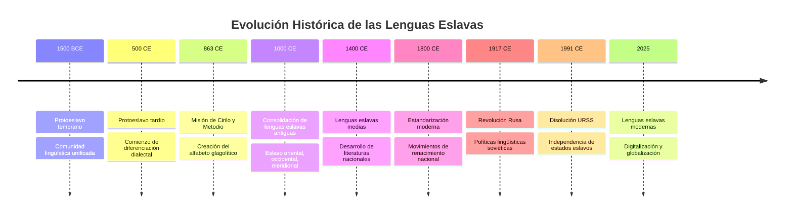
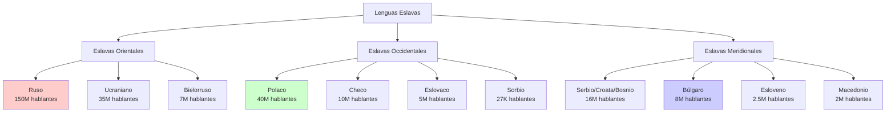
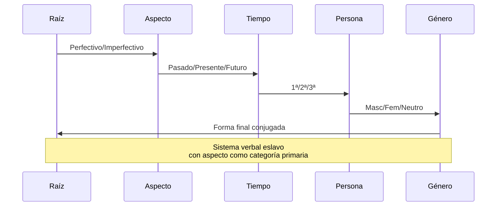

# 📙 Lenguas Eslavas: Los Idiomas de Europa Oriental

**Breadcrumb**: [🏠 Inicio](index.md) > [🏛️ Familias Lingüísticas](#) > Lenguas Eslavas

---

**📅 Fecha de creación**: 20 de octubre de 2025  
**🔄 Última actualización**: 22 de octubre de 2025  
**⏱️ Tiempo de lectura**: 11 minutos  
**🏷️ Etiquetas**: `Eslavo` `Ruso` `Polaco` `Checo` `Cirílico` `Europa-Oriental`

---

## 📑 Tabla de Contenidos

1. [Introducción](#introducción)
2. [Origen e Historia](#origen-e-historia)
3. [Clasificación de las Lenguas Eslavas](#clasificación-de-las-lenguas-eslavas)
4. [Características Lingüísticas](#características-lingüísticas)
5. [Sistemas de Escritura](#sistemas-de-escritura)
6. [Distribución y Demografía](#distribución-y-demografía)
7. [Contexto Político y Cultural](#contexto-político-y-cultural)
8. [Conclusiones](#conclusiones)

---

## Introducción

Las **lenguas eslavas** constituyen la rama más extensa de la familia indoeuropea en términos de hablantes nativos en Europa, con aproximadamente 315 millones de personas. Estas lenguas se distribuyen principalmente por Europa Oriental, los Balcanes y partes de Europa Central, formando un continuo lingüístico que se extiende desde el Mar Adriático hasta el Océano Pacífico[1].

El término **eslavo** proviene del [protoeslavo](glosario.md#protoeslavo) *slověninъ*, que significa "persona que habla (de forma comprensible)", en contraste con *němьcь* (alemán), que literalmente significa "mudo" o "incomprensible". Esta etimología refleja la conciencia histórica de los pueblos eslavos sobre su parentesco lingüístico y su distinción frente a los pueblos germánicos vecinos.

Las lenguas eslavas comparten una herencia común que se manifiesta en similitudes fonéticas, morfológicas y léxicas significativas. A pesar de más de mil años de desarrollo independiente, muchas lenguas eslavas mantienen un grado considerable de **inteligibilidad mutua**, especialmente entre lenguas del mismo subgrupo. Un hablante de polaco puede entender parcialmente el checo, y un hablante de ruso puede comprender cierto ucraniano o bielorruso sin estudio formal previo.

La importancia geopolítica de las lenguas eslavas es inmensa. El **ruso**, con más de 150 millones de hablantes nativos, es no solo la lengua eslava más hablada sino también uno de los seis idiomas oficiales de las Naciones Unidas. El **polaco**, con 40 millones de hablantes, es la segunda lengua eslava más hablada en la Unión Europea después del ruso (si se considera a Rusia parte de Europa)[2].

> [!NOTE]
> Las lenguas eslavas son relativamente conservadoras en su morfología, manteniendo sistemas complejos de declinación nominal y conjugación verbal que se han simplificado en muchas otras lenguas indoeuropeas.

---

## Origen e Historia

### Protoeslavo y la Urheimat Eslava

El **protoeslavo** es la lengua ancestral reconstruida de la cual descienden todas las lenguas eslavas modernas. Los lingüistas sitúan su periodo de unidad aproximadamente entre el 1500 a.C. y el 500 d.C., aunque estas fechas son objeto de debate académico. La ubicación geográfica original de los hablantes de protoeslavo, conocida como *Urheimat* (patria original), es controvertida, aunque la mayoría de teorías la sitúan en algún lugar entre el río Vístula y el río Dniéper, en lo que hoy son Polonia y Ucrania[3].

Durante el primer milenio de nuestra era, los pueblos eslavos experimentaron una expansión demográfica y territorial extraordinaria, conocida como la **Expansión Eslava**. Este proceso los llevó desde su territorio original hacia el sur (Balcanes), oeste (hasta el río Elba en la actual Alemania) y este (hasta los Urales y más allá). Esta expansión fue facilitada por el debilitamiento del Imperio Romano y las migraciones de pueblos germánicos hacia el oeste.

### El Eslavo Eclesiástico Antiguo

Un hito fundamental en la historia eslava fue la creación del **eslavo eclesiástico antiguo** en el siglo IX. Los hermanos bizantinos [Cirilo y Metodio](glosario.md#cirilo-y-metodio) desarrollaron el alfabeto **glagolítico** (precursor del cirílico) para traducir textos litúrgicos cristianos al eslavo, específicamente al dialecto macedonio-búlgaro que conocían. Esta lengua literaria se convirtió en la lingua franca de los eslavos cristianos ortodoxos durante siglos[4].

El eslavo eclesiástico antiguo tuvo una importancia comparable a la del latín en Europa Occidental. Fue la lengua de educación, liturgia y literatura en el mundo eslavo oriental y meridional hasta bien entrada la Edad Moderna. Su influencia en las lenguas eslavas modernas es profunda, especialmente en el vocabulario abstracto, religioso y literario.

📚 Información adicional: La Controversia Filioque

La adopción del eslavo eclesiástico como lengua litúrgica fue controversial. Roma tradicionalmente exigía el uso del latín, griego o hebreo en la liturgia. Sin embargo, el Papa Adriano II aprobó el uso del eslavo en 869, reconociendo la obra de Cirilo y Metodio. Esta decisión reflejaba las tensiones entre Roma y Constantinopla que eventualmente llevarían al Cisma de Oriente en 1054. 

El eslavo eclesiástico se convirtió en un marcador de identidad ortodoxa frente al catolicismo latino, contribuyendo a la división cultural entre eslavos occidentales (católicos, alfabeto latino) y eslavos orientales/meridionales (ortodoxos, alfabeto cirílico).

### Diferenciación en Tres Ramas

La fragmentación del protoeslavo en las tres ramas modernas (oriental, occidental y meridional) fue un proceso gradual que se aceleró a partir del siglo VI con las migraciones eslavas. Las **invasiones ávaras** del siglo VII separaron físicamente a los eslavos meridionales de los occidentales y orientales, interrumpiendo el contacto lingüístico y acelerando la divergencia.

Hacia el siglo X, las diferencias entre las tres ramas eran suficientemente pronunciadas para considerar que existían lenguas distintas. El desarrollo de estructuras políticas separadas (el Estado de Kíev, el reino de Polonia, los estados búlgaros y serbios) institucionalizó estas diferencias lingüísticas y promovió la estandarización de variedades locales.

### Influencias Externas

Las lenguas eslavas han estado en contacto con numerosas lenguas no eslavas a lo largo de su historia, lo que ha enriquecido su vocabulario:

- **Contacto germánico**: Especialmente en lenguas eslavas occidentales (polaco, checo), con préstamos relacionados con tecnología, comercio y administración
- **Contacto turco**: Las lenguas eslavas meridionales incorporaron vocabulario turco durante el dominio otomano
- **Contacto húngaro y rumano**: Influyeron en lenguas eslavas vecinas de los Balcanes
- **Contacto mongol y túrquico**: Influyeron en el ruso, especialmente durante el dominio mongol (1240-1480)
- **Griego bizantino**: A través del eslavo eclesiástico, influyó en vocabulario religioso y cultural

> [!IMPORTANT]
> A pesar de estas influencias externas, las lenguas eslavas mantienen un núcleo léxico y estructural fuertemente conservador, con más del 60-70% del vocabulario básico derivado directamente del protoeslavo.

---

## Clasificación de las Lenguas Eslavas

Las lenguas eslavas se dividen tradicionalmente en **tres ramas** basadas en criterios geográficos e históricos, aunque la lingüística moderna también reconoce criterios fonológicos y morfológicos que justifican esta clasificación[5].

### Lenguas Eslavas Orientales

Este grupo incluye las lenguas habladas en la mayor parte del territorio de la antigua Rus de Kiev:

**Ruso** (*русский язык*)  
La lengua eslava más hablada, con más de 150 millones de hablantes nativos y 110 millones adicionales como segunda lengua. Es lengua oficial de Rusia, Bielorrusia, Kazajistán y Kirguistán, y tiene estatus oficial en varias regiones de otros países post-soviéticos. El ruso moderno se estandarizó en el siglo XIX, influenciado significativamente por la obra de Alexander Pushkin[6].

El ruso se caracteriza por:
- Sistema de casos con seis casos nominales
- Aspecto verbal perfectivo/imperfectivo altamente desarrollado
- Acento léxico móvil (puede cambiar la posición dentro de una palabra)
- Reducción vocálica en sílabas átonas (*akan'je*)
- Consonantes palatalizadas vs. no palatalizadas como rasgo distintivo

**Ucraniano** (*українська мова*)  
Aproximadamente 35 millones de hablantes nativos, principalmente en Ucrania donde es la única lengua oficial desde 2019. Se diferencia del ruso en fonética (preserva más distinciones vocálicas), vocabulario (más influencia polaca y menos influencia túrquica) y algunas características gramaticales. Históricamente denominado "pequeño ruso" por el Imperio Ruso, el ucraniano experimentó represión durante periodos de rusificación[7].

**Bielorruso** (*беларуская мова*)  
Unos 5-7 millones de hablantes nativos en Bielorrusia y la diáspora. Ha sido históricamente subordinado al ruso en Bielorrusia, aunque ha habido esfuerzos de revitalización desde la independencia en 1991. Presenta características intermedias entre ruso y ucraniano, con influencia significativa del polaco.

**Rusino**  
Variedad controvertida hablada en Transcarpatia (Ucrania), partes de Eslovaquia, Polonia y Serbia. Algunos lingüistas lo consideran una lengua separada, otros un dialecto del ucraniano. Tiene unos 600,000 hablantes.

### Lenguas Eslavas Occidentales

Este grupo se caracteriza por el uso del alfabeto latino y la influencia del catolicismo romano:

**Polaco** (*polski*)  
Con 40 millones de hablantes nativos, es la segunda lengua eslava más hablada. Lengua oficial de Polonia y reconocida como minoritaria en varios países vecinos. El polaco se estandarizó relativamente temprano, con la primera gramática impresa en 1518. Se caracteriza por:
- Ortografía históricamente compleja con dígrafos (*sz, cz, rz*)
- Preservación de nasales vocálicas (*ą, ę*)
- Sistema complejo de palatalizaciones
- Siete casos nominales

**Checo** (*čeština*)  
Aproximadamente 10 millones de hablantes en la República Checa. Fue estandarizado en el siglo XIX durante el Renacimiento Nacional Checo, basándose en las formas del checo medieval. Es notable por:
- Distinción de cantidad vocálica (vocales largas vs. cortas)
- Sistema rico de diminutivos
- Ortografía reformada por Jan Hus en el siglo XV (uso de diacríticos como *č, š, ž*)

**Eslovaco** (*slovenčina*)  
Unos 5 millones de hablantes en Eslovaquia. Muy cercano al checo (ambos mantienen considerable inteligibilidad mutua). Se estandarizó en el siglo XIX, más tarde que el checo.

**Sorbio**  
Lengua minoritaria en el este de Alemania (Lusacia) con dos variedades: alto sorbio (unos 20,000 hablantes) y bajo sorbio (unos 7,000 hablantes). Es el último vestigio de las lenguas eslavas que una vez se hablaron ampliamente en la actual Alemania oriental.

**Casubio**  
Hablado en la región de Cashubia en el norte de Polonia. Estatus controvertido: algunos lo consideran dialecto del polaco, otros una lengua separada. Unos 50,000 hablantes activos.

### Lenguas Eslavas Meridionales

Este grupo se extiende por los Balcanes y muestra la mayor diversidad:

**Serbio** (*српски*) **y Croata** (*hrvatski*)  
Lingüísticamente muy similares, hasta 1990 consideradas una sola lengua **serbocroata**. La fragmentación de Yugoslavia llevó a la afirmación de identidades lingüísticas separadas. Principal diferencia: el serbio usa cirílico (aunque también latino), el croata usa solo latino. Juntas suman unos 16 millones de hablantes.

**Bosnio** (*bosanski*)  
Muy similar al serbio y croata, se reconoció como lengua separada tras la independencia de Bosnia-Herzegovina. Usa alfabeto latino.

**Montenegrino** (*crnogorski*)  
La variedad más reciente en ser reconocida como lengua separada (2007). Esencialmente idéntica al serbio con pequeñas diferencias ortográficas.

**Esloveno** (*slovenščina*)  
Unos 2.5 millones de hablantes en Eslovenia y regiones limítrofes. Es la lengua eslava meridional más diferenciada, con características arcaicas como el **dual** (número gramatical para dos entidades, además del singular y plural).

**Macedonio** (*македонски*)  
Aproximadamente 2 millones de hablantes en Macedonia del Norte y la diáspora. Reconocido como lengua estándar separada del búlgaro en 1945, aunque Bulgaria no reconoce esta distinción. Se caracteriza por la pérdida de casos y el desarrollo de artículos pospuestos.

**Búlgaro** (*български*)  
Unos 8 millones de hablantes en Bulgaria y comunidades diaspóricas. Es la lengua eslava meridional más hablada. Se caracteriza por:
- Pérdida completa del sistema de casos
- Desarrollo de artículos definidos pospuestos
- Sistema verbal complejo con distinciones evidenciales (información de segunda mano)

💡 Ejemplo detallado: Inteligibilidad Mutua

La inteligibilidad mutua entre lenguas eslavas varía considerablemente. Estudios sugieren los siguientes niveles aproximados de comprensión oral sin entrenamiento previo:

**Alta inteligibilidad** (>60%):
- Checo ↔ Eslovaco
- Ruso ↔ Bielorruso
- Serbio ↔ Croata ↔ Bosnio

**Inteligibilidad moderada** (30-60%):
- Ruso ↔ Ucraniano
- Polaco ↔ Eslovaco
- Búlgaro ↔ Macedonio

**Inteligibilidad baja** (<30%):
- Ruso ↔ Polaco
- Búlgaro ↔ Ruso
- Esloveno ↔ Cualquier eslava oriental

La inteligibilidad escrita es generalmente mayor que la oral, especialmente cuando las lenguas comparten el mismo alfabeto.

---

## Características Lingüísticas

### Fonética y Fonología

Las lenguas eslavas presentan varios rasgos fonológicos distintivos que las diferencian de otras ramas indoeuropeas:

**Consonantes palatalizadas**: La distinción entre consonantes **duras** (no palatalizadas) y **blandas** (palatalizadas) es fundamental en muchas lenguas eslavas, especialmente el ruso. Esta distinción afecta no solo a la pronunciación sino también a la ortografía y la morfología. Por ejemplo, en ruso: *мать* /matʲ/ (madre) vs *мат* /mat/ (jerga)[8].

**Grupos consonánticos complejos**: Las lenguas eslavas permiten secuencias de consonantes que son imposibles en muchas otras lenguas. Palabras polacas como *szcz* (mandíbula) o checas como *strč prst skrz krk* (mete el dedo en la garganta, una oración sin vocales) ilustran esta característica.

**Reducción vocálica**: En ruso y búlgaro, las vocales en sílabas átonas se reducen significativamente. En ruso, el fenómeno del *akan'je* convierte /o/ y /a/ átonas en una vocal neutra similar a /ə/.

### Morfología

La morfología eslava es notablemente **sintética** e **inflexional**, manteniendo características del protoindoeuropeo que se han perdido en muchas otras lenguas:

**Sistema de casos**: La mayoría de lenguas eslavas mantienen un sistema de casos nominales robusto:

| Lengua | Número de Casos | Casos Preservados |
|--------|-----------------|-------------------|
| **Ruso** | 6 | Nominativo, Genitivo, Dativo, Acusativo, Instrumental, Locativo |
| **Polaco** | 7 | Idem + Vocativo |
| **Checo** | 7 | Idem + Vocativo |
| **Esloveno** | 6 | Como ruso |
| **Serbio** | 7 | Como polaco |
| **Búlgaro** | 0 | Sistema analítico con preposiciones |
| **Macedonio** | 0 | Sistema analítico con preposiciones |

**Aspecto verbal**: El aspecto es quizás la característica más distintiva de la gramática eslava. La mayoría de verbos existe en pares **perfectivo/imperfectivo**, indicando si una acción se ve como completa o en proceso:

- Ruso: *читать* (čitat', imperfectivo: "leer/estar leyendo") vs *прочитать* (pročitat', perfectivo: "leer completamente")
- Polaco: *pisać* (imperfectivo: "escribir") vs *napisać* (perfectivo: "escribir completamente")

Este sistema permite expresar distinciones temporales y aspectuales con gran precisión, pero puede ser difícil de dominar para hablantes de lenguas sin esta distinción gramaticalizada.

**Género gramatical**: Todas las lenguas eslavas mantienen tres géneros gramaticales (masculino, femenino, neutro), con concordancia obligatoria entre sustantivos, adjetivos, pronombres y, en pasado, verbos.

### Sintaxis

El orden de palabras en las lenguas eslavas es relativamente **libre** comparado con lenguas como el inglés, gracias al sistema de casos que marca las funciones sintácticas. Sin embargo, existen preferencias estadísticas:

- **Orden básico**: SVO (Sujeto-Verbo-Objeto) es el más común, pero se permiten otros órdenes para énfasis o focalización
- **Posición de clíticos**: Las lenguas eslavas occidentales tienden a colocar clíticos en segunda posición (Ley de Wackernagel)
- **Negación**: Generalmente preverbal, con concordancia negativa (múltiples negaciones refuerzan la negación, no la cancelan)

**Ejemplo de flexibilidad sintáctica en ruso**:
- Иван читает книгу (Ivan lee un libro) - SVO, orden neutro
- Книгу читает Иван (Un libro lee Ivan) - OVS, énfasis en "libro"
- Читает Иван книгу (Lee Ivan un libro) - VSO, énfasis en la acción

### Léxico

El léxico eslavo muestra una notable **homogeneidad** en el vocabulario básico, resultado de su origen común relativamente reciente (en términos históricos):

| Concepto | Ruso | Polaco | Checo | Serbio | Búlgaro |
|----------|------|--------|-------|--------|---------|
| Agua | вода (voda) | woda | voda | voda | вода (voda) |
| Casa | дом (dom) | dom | dům | dom | дом (dom) |
| Noche | ночь (noč') | noc | noc | noć | нощ (nosht) |
| Dos | два (dva) | dwa | dva | dva | два (dva) |
| Nuevo | новый (novyj) | nowy | nový | nov | нов (nov) |

El vocabulario abstracto y técnico, sin embargo, muestra mayor divergencia, influenciado por contactos históricos diferentes. El ruso tomó mucho vocabulario técnico del alemán y francés, el polaco del latín y alemán, las lenguas meridionales del turco y griego.

> [!TIP]
> Para entender mejor las diferencias entre los alfabetos usados en lenguas eslavas, consulta el artículo sobre [Sistemas de Escritura](articulo-4.md).

---

## Sistemas de Escritura

Las lenguas eslavas utilizan dos alfabetos principales: el **latino** y el **cirílico**, una división que refleja profundas diferencias religiosas, culturales y políticas[9].

### Alfabeto Cirílico

El alfabeto **cirílico** es usado por todas las lenguas eslavas orientales (ruso, ucraniano, bielorruso) y algunas meridionales (búlgaro, macedonio, serbio). Deriva del alfabeto **glagolítico** creado por Cirilo y Metodio en el siglo IX, aunque el cirílico propiamente dicho fue desarrollado posteriormente, probablemente en la escuela literaria de Preslav (Bulgaria) en el siglo X.

El cirílico moderno existe en varias variantes nacionales:

| Alfabeto | Letras | Lengua | Características Únicas |
|----------|---------|--------|------------------------|
| **Ruso** | 33 | Ruso | Ё, Ъ, Ы, Э |
| **Ucraniano** | 33 | Ucraniano | Ґ, Є, І, Ї |
| **Bielorruso** | 32 | Bielorruso | Ў, І |
| **Búlgaro** | 30 | Búlgaro | Similar al ruso sin Ё, Ы, Э |
| **Serbio** | 30 | Serbio | Ђ, Ј, Љ, Њ, Ћ, Џ |
| **Macedonio** | 31 | Macedonio | Ѓ, Ѕ, Ќ, Љ, Њ, Џ |

El cirílico ruso se basa en la **reforma de Pedro el Grande** (1708-1710) que simplificó el eslavo eclesiástico, y la **reforma bolchevique** de 1918 que eliminó letras obsoletas. El resultado es un sistema relativamente fonémico donde cada letra representa generalmente un sonido específico.

📖 Datos históricos: Reformas ortográficas soviéticas

Durante el periodo soviético, hubo varios intentos de reformar o incluso reemplazar el alfabeto cirílico. En los años 1920-1930, se desarrollaron proyectos de **romanización** (latinización) de las lenguas soviéticas. Algunas lenguas túrquicas y caucásicas fueron romanizadas temporalmente.

Sin embargo, en 1936-1940, Stalin revirtió estas políticas, y se impuso el cirílico a todas las lenguas soviéticas que antes usaban árabe, latino u otros alfabetos. Esto creó una unificación gráfica del espacio soviético, pero también borró tradiciones ortográficas locales. 

Tras la disolución de la URSS, algunos países (Moldavia, Azerbaiyán, Turkmenistán, Uzbekistán) volvieron al alfabeto latino, aunque las poblaciones rusohablantes mantienen el cirílico.

### Alfabeto Latino

Las lenguas eslavas occidentales (polaco, checo, eslovaco, sorbio) y algunas meridionales (esloveno, croata) usan el **alfabeto latino**, adaptado con diacríticos para representar sonidos eslavos no presentes en el latín.

**Polaco**: Usa una ortografía compleja con dígrafos (*sz, cz, rz*) y letras con diacríticos (*ą, ć, ę, ł, ń, ó, ś, ź, ż*). Esta complejidad refleja la rica fonología polaca con múltiples series de consonantes palatalizadas.

**Checo**: El sistema de **Jan Hus** del siglo XV introdujo los háčeks (acentos invertidos) sobre consonantes (*č, š, ž, ř*) y el uso de acentos agudos para vocales largas (*á, é, í, ó, ú, ý*). Este sistema influyó en otras ortografías eslavas.

**Serbio**: Situación única de **bigrafismo** donde tanto el cirílico como el latino son oficiales. La constitución serbia estipula el cirílico como principal, pero en la práctica el latino es muy usado, especialmente en medios digitales.

### Comparación de Escrituras

La frase "¿Cómo estás?" en diferentes lenguas eslavas ilustra la diversidad ortográfica:

| Lengua | Alfabeto | Frase |
|--------|----------|-------|
| **Ruso** | Cirílico | Как дела? |
| **Ucraniano** | Cirílico | Як справи? |
| **Polaco** | Latino | Jak się masz? |
| **Checo** | Latino | Jak se máš? |
| **Serbio** | Cirílico | Како си? |
| **Serbio** | Latino | Kako si? |
| **Búlgaro** | Cirílico | Как си? |
| **Esloveno** | Latino | Kako si? |

> [!NOTE]
> La elección del alfabeto no es puramente técnica sino profundamente política y cultural, reflejando afiliaciones religiosas (católico vs. ortodoxo), orientaciones geopolíticas (occidental vs. oriental) e identidades nacionales.

---

## Distribución y Demografía

### Geografía de las Lenguas Eslavas

Las lenguas eslavas ocupan un territorio vasto y continuo en Europa, desde el Mar Adriático hasta el Océano Pacífico (considerando Rusia en su totalidad). Este territorio, conocido como **Eslavonia** o el mundo eslavo, tiene una población total de más de 300 millones de personas[10].

**Europa Oriental**: Dominada por el ruso, ucraniano y bielorruso. Rusia es el país más extenso del mundo, aunque la mayoría de su población se concentra en la parte europea. Ucrania y Bielorrusia forman un núcleo eslavo oriental junto con la Rusia europea.

**Europa Central**: Polonia es el país eslavo más grande de esta región, con 38 millones de habitantes. República Checa (10 millones) y Eslovaquia (5 millones) forman el corazón de la Eslavonia occidental.

**Balcanes**: La región más fragmentada lingüísticamente, con esloveno en el norte, serbio-croata-bosnio-montenegrino en el centro, macedonio y búlgaro en el sur. Esta fragmentación refleja la historia compleja de los Balcanes, con múltiples imperios (Otomano, Austro-Húngaro) dejando su huella.

### Demografía y Vitalidad

| Lengua | Hablantes Nativos | Hablantes Totales | Países Oficiales | Estado |
|--------|-------------------|-------------------|------------------|--------|
| **Ruso** | 150M | 260M | 4 | Saludable |
| **Polaco** | 40M | 50M | 1 | Saludable |
| **Ucraniano** | 35M | 40M | 1 | Vulnerable |
| **Serbio** | 9M | 12M | 4 | Saludable |
| **Checo** | 10M | 13M | 1 | Saludable |
| **Búlgaro** | 8M | 9M | 1 | Saludable |
| **Bielorruso** | 5M | 7M | 1 | En peligro |
| **Eslovaco** | 5M | 7M | 1 | Saludable |
| **Croata** | 5M | 7M | 3 | Saludable |
| **Esloveno** | 2.5M | 2.7M | 1 | Vulnerable |
| **Macedonio** | 2M | 2M | 1 | Vulnerable |
| **Bosnio** | 2M | 3M | 1 | Saludable |
| **Sorbio** | 27K | 30K | 0 | En peligro crítico |

### Diáspora Eslava

La diáspora eslava es significativa en varios países:

**Estados Unidos**: Gran comunidad de habla polaca (concentrada en Chicago, Nueva York), rusa (costa este y oeste) y otras lenguas eslavas, resultado de múltiples olas migratorias desde el siglo XIX.

**Alemania**: Importante población polaca y rusa, con lenguas oficialmente reconocidas en algunas regiones (especialmente el sorbio en Lusacia).

**Israel**: Gran comunidad rusohablante (más de 1 millón), resultado de inmigración desde la antigua URSS en los años 1990.

**Canadá**: Comunidades significativas de habla ucraniana, polaca y rusa, especialmente en las provincias occidentales.

**América Latina**: Argentina tiene una importante comunidad de habla polaca y ucraniana, Brasil tiene hablantes de polaco y ucraniano en el sur.

---

## Contexto Político y Cultural

### Políticas Lingüísticas

Las políticas lingüísticas en países eslavos han estado históricamente ligadas a cuestiones de identidad nacional y geopolítica[11].

**Rusificación**: Durante el Imperio Ruso y la URSS, existieron políticas de promoción del ruso a expensas de otras lenguas, incluyendo lenguas eslavas como el ucraniano, bielorruso y polaco. Esto generó tensiones que persisten hoy.

**Desovietización lingüística**: Tras 1991, países como Ucrania, los países bálticos (con poblaciones rusohablantes) y estados de Asia Central implementaron políticas para reducir el dominio del ruso y promover lenguas nacionales. En Ucrania, la ley de 2019 establece el ucraniano como única lengua oficial.

**Yugoslavia y la fragmentación lingüística**: La disolución de Yugoslavia llevó a la afirmación de identidades lingüísticas separadas. El serbocroata se dividió oficialmente en serbio, croata, bosnio y montenegrino, aunque lingüísticamente siguen siendo mutuamente inteligibles. Esta fragmentación es más política que lingüística.

**Unión Europea**: Cinco lenguas eslavas son oficiales en la UE (polaco, checo, eslovaco, esloveno, búlgaro), más el croata desde 2013. Esto garantiza derechos lingüísticos pero también plantea desafíos de traducción e interpretación.

### Identidad y Cultura

Las lenguas eslavas son marcadores fundamentales de identidad nacional. La literatura eslava ha producido figuras mundiales:

**Literatura rusa**: Tolstoi, Dostoievski, Chéjov, Pushkin, Gógol son pilares de la literatura mundial.

**Literatura polaca**: Adam Mickiewicz, Henryk Sienkiewicz (Premio Nobel 1905), Czesław Miłosz (Nobel 1980), Wisława Szymborska (Nobel 1996).

**Literatura checa**: Franz Kafka (aunque escribió en alemán), Milan Kundera, Václav Havel.

**Literatura yugoslava**: Ivo Andrić (Nobel 1961).

La **música** es otro ámbito donde las lenguas eslavas brillan. La tradición coral eslava es famosa mundialmente. Compositores eslavos como Tchaikovsky, Rachmaninoff, Dvořák, Chopin usaron elementos de sus lenguas y folklore en sus obras.

El **cine** en lenguas eslavas ha ganado reconocimiento internacional. El cine polaco (Andrzej Wajda, Roman Polanski, Krzysztof Kieślowski), el cine checo (Miloš Forman), el cine ruso (Andrei Tarkovsky, Sergei Eisenstein) y el cine yugoslavo han dejado huella en el séptimo arte.

💡 Ejemplo detallado: Relación entre lengua e identidad nacional

El caso del **ucraniano** ilustra perfectamente cómo la lengua se entrelaza con la política y la identidad. Durante siglos, el ucraniano fue considerado un "dialecto" del ruso por las autoridades imperiales y soviéticas. Políticas de rusificación intentaron marginar el ucraniano.

Tras la independencia en 1991, Ucrania enfrentó la cuestión de cómo definir su identidad nacional. El ucraniano se convirtió en símbolo de soberanía, aunque en el este y sur del país el ruso seguía predominando. La Revolución Naranja (2004) y la Euromaidán (2014) tuvieron fuertes componentes lingüísticos, con manifestantes defendiendo el ucraniano contra la influencia rusa.

La guerra actual (desde 2014/2022) ha intensificado el aspecto lingüístico de la identidad nacional ucraniana, con políticas más agresivas de promoción del ucraniano y restricción del ruso en espacios públicos. Este proceso muestra cómo la lengua no es solo un medio de comunicación sino un símbolo político cargado de significado.

### Religión

La división religiosa entre catolicismo romano (eslavos occidentales), ortodoxia oriental (eslavos orientales y meridionales) y islam (algunos eslavos meridionales, especialmente bosnios) ha moldeado profundamente las lenguas eslavas, especialmente en vocabulario religioso y cultural.

El **eslavo eclesiástico** sigue siendo la lengua litúrgica de la Iglesia Ortodoxa Rusa y otras iglesias ortodoxas eslavas, creando una situación de **diglosia** donde coexisten el eslavo litúrgico arcaico y las lenguas vernáculas modernas.

---

## Conclusiones

Las lenguas eslavas representan una de las familias lingüísticas más vitales y extensas de Europa. Con más de 315 millones de hablantes nativos y una distribución geográfica que abarca desde el Adriático hasta el Pacífico, estas lenguas son elementos fundamentales del panorama lingüístico europeo y mundial.

La **unidad en la diversidad** caracteriza a las lenguas eslavas. A pesar de siglos de desarrollo independiente y diversas influencias externas, mantienen características estructurales comunes que reflejan su origen compartido. El sistema de casos, el aspecto verbal, la fonología rica en consonantes y un núcleo léxico común son rasgos que unen a todas las lenguas eslavas.

Sin embargo, las lenguas eslavas también exhiben una notable **diversidad**, no solo entre las tres ramas principales sino también dentro de cada rama. Esta diversidad refleja historias políticas, culturales y religiosas distintas. El uso del [alfabeto cirílico vs. latino](articulo-4.md) es quizás la manifestación más visible de estas diferencias, simbolizando orientaciones culturales y religiosas divergentes.

El futuro de las lenguas eslavas presenta tanto desafíos como oportunidades. El **dominio del inglés** como lengua global, especialmente en tecnología y ciencia, presiona a las lenguas eslavas. Las lenguas minoritarias como el sorbio o el casubio enfrentan riesgos de desplazamiento. Sin embargo, las lenguas eslavas mayores (ruso, polaco, ucraniano) mantienen fuerte vitalidad, respaldadas por estados-nación y políticas lingüísticas activas.

El desarrollo de **tecnologías digitales** para lenguas eslavas avanza rápidamente. El procesamiento de lenguaje natural, traducción automática y recursos digitales para ruso, polaco y otras lenguas eslavas mejora constantemente, aunque existe desigualdad entre lenguas mayores y minoritarias.

Las lenguas eslavas continuarán siendo pilares de la [diversidad lingüística europea](articulo-5.md), portadoras de ricas tradiciones culturales y literarias, y herramientas de comunicación para cientos de millones de personas en Europa y el mundo.

---

## 📚 Notas y Referencias

[1] Sussex, Roland & Cubberley, Paul. *The Slavic Languages*. Cambridge University Press, 2006. - Obra de referencia comprensiva sobre todas las lenguas eslavas.

[2] Comrie, Bernard & Corbett, Greville (eds.). *The Slavonic Languages*. Routledge, 1993. - Descripción detallada de cada lengua eslava individual.

[3] Schenker, Alexander M. *The Dawn of Slavic: An Introduction to Slavic Philology*. Yale University Press, 1995. - Análisis del protoeslavo y la formación de las lenguas eslavas.

---

## 🔗 Ver También

- [Lenguas Romances](articulo-1.md) - Otra gran familia lingüística europea
- [Lenguas Germánicas](articulo-2.md) - Vecinos lingüísticos de las lenguas eslavas
- [Sistemas de Escritura](articulo-4.md) - Cirílico y latino en detalle
- [Multilingüismo Europeo](articulo-5.md) - Contexto político y cultural actual
- [Glosario](glosario.md) - Términos especializados

---

**[↑ Volver arriba](#-lenguas-eslavas-los-idiomas-de-europa-oriental)**

[← Anterior: Lenguas Germánicas](articulo-2.md) | [Siguiente: Sistemas de Escritura →](articulo-4.md)
