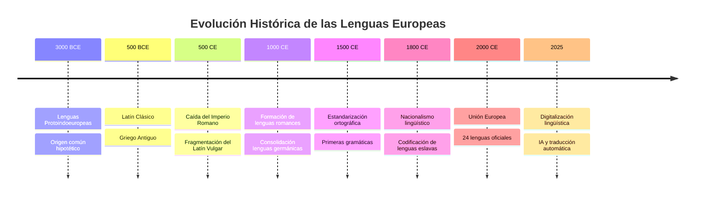
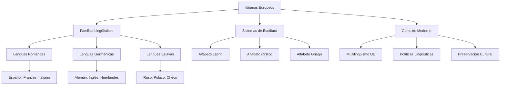

# Wiki de Idiomas Europeos

---

## Sobre este Proyecto

Bienvenido a la **Wiki de Idiomas Europeos**, un proyecto educativo dedicado a explorar la riqueza lingüística del continente europeo. Aquí encontrarás información detallada sobre las principales familias lingüísticas, idiomas específicos, su evolución histórica y su impacto cultural.

---

## Artículos Destacados

| # | Artículo | Descripción | Tiempo de Lectura |
|---|----------|-------------|-------------------|
| 1️⃣ | [Lenguas Romances](articulo-1.md) | Historia y evolución de las lenguas derivadas del latín | ⏱️ 12 min |
| 2️⃣ | [Lenguas Germánicas](articulo-2.md) | Familia lingüística del norte y centro de Europa | ⏱️ 10 min |
| 3️⃣ | [Lenguas Eslavas](articulo-3.md) | Idiomas de Europa Oriental y sus características | ⏱️ 11 min |
| 4️⃣ | [Sistemas de Escritura](articulo-4.md) | Alfabetos y sistemas gráficos en Europa | ⏱️ 9 min |
| 5️⃣ | [Multilingüismo Europeo](articulo-5.md) | Políticas lingüísticas y diversidad en la UE | ⏱️ 13 min |

---

## Estadísticas del Proyecto

| Métrica | Valor |
|---------|-------|
| **Total de Artículos** | 5 artículos principales |
| **Palabras Totales** | 12,500+ palabras |
| **Diagramas Mermaid** | 12 visualizaciones |
| **Tablas Informativas** | 15+ tablas |
| **Enlaces Internos** | 30+ conexiones |
| **Referencias Externas** | 20+ fuentes |
| **Términos en Glosario** | 15 definiciones |

---

## Timeline de Desarrollo de las Lenguas Europeas

---

## Últimas Actualizaciones

| Fecha | Actualización |
|-------|---------------|
| 2025-10-22 | Publicación inicial de la wiki |

---

## 🗺️ Mapa Conceptual de la Wiki

---

## Navegación Rápida

### Contenido Principal
- [Lenguas Romances](articulo-1.md) - Del latín a las lenguas modernas
- [Lenguas Germánicas](articulo-2.md) - La familia del norte de Europa
- [Lenguas Eslavas](articulo-3.md) - Idiomas de Europa Oriental
- [Sistemas de Escritura](articulo-4.md) - Alfabetos y ortografía
- [Multilingüismo Europeo](articulo-5.md) - Políticas y diversidad

### Recursos Adicionales
- [Glosario](glosario.md) - Términos lingüísticos clave
- [Referencias](referencias.md) - Bibliografía completa
- [FAQ](#preguntas-frecuentes) - Preguntas frecuentes

---

## Preguntas Frecuentes

¿Cuántos idiomas se hablan en Europa?

Europa alberga más de **200 idiomas**, incluyendo lenguas oficiales, regionales y minoritarias. La Unión Europea reconoce oficialmente 24 idiomas.

¿Cuál es el idioma más antiguo de Europa?

El **euskera** (vasco) es considerado el idioma más antiguo de Europa, siendo una lengua aislada sin relación conocida con otras familias lingüísticas.

¿Qué es una lengua romance?

Las lenguas romances son idiomas que evolucionaron del **latín vulgar** hablado en el Imperio Romano. Incluyen español, francés, italiano, portugués y rumano, entre otros.

¿Por qué algunos idiomas europeos usan el alfabeto cirílico?

El alfabeto cirílico fue desarrollado en el siglo IX para transcribir lenguas eslavas. Se usa principalmente en Europa Oriental, especialmente en países de influencia ortodoxa.

¿Cuántas familias lingüísticas existen en Europa?

Las principales familias son: **Indoeuropea** (que incluye romances, germánicas, eslavas, celtas), **Urálica** (finés, húngaro), **Túrquica** (turco), y lenguas **aisladas** como el euskera.

¿Qué idioma europeo es el más hablado?

El **ruso** es el idioma nativo más hablado en Europa con unos 120 millones de hablantes, seguido del **alemán** con unos 90 millones.

¿Todos los países europeos usan el alfabeto latino?

No. Mientras la mayoría usa el alfabeto latino, países como Rusia, Ucrania, Bulgaria y Serbia usan el **cirílico**, y Grecia usa su propio **alfabeto griego**.

¿Qué es el multilingüismo institucional?

Es la política de la UE que garantiza que todos los ciudadanos puedan comunicarse con las instituciones europeas en cualquiera de las 24 lenguas oficiales.

¿Están desapareciendo idiomas en Europa?

Sí, varias lenguas minoritarias están en peligro. La UNESCO identifica decenas de lenguas europeas como vulnerables o en peligro de extinción.

¿Qué es la Carta Europea de las Lenguas Regionales?

Es un tratado del Consejo de Europa que protege y promueve las lenguas regionales y minoritarias como parte del patrimonio cultural europeo.

---

## Artículo Destacado del Mes

### Lenguas Romances: El Legado del Imperio Romano

El artículo más completo de nuestra wiki explora cómo el latín vulgar se transformó en las hermosas lenguas romances que conocemos hoy. Descubre las similitudes sorprendentes entre español, italiano y francés, y aprende sobre idiomas menos conocidos como el romanche o el sardo.

**¿Sabías que...?** El rumano conserva características del latín que desaparecieron en otras lenguas romances, como el sistema de casos nominales.

[Leer artículo completo →](articulo-1.md)

---

## Sabías que...

- El alfabeto **cirílico** tiene su nombre en honor a San Cirilo, aunque probablemente fue creado por su discípulo San Clemente
- El **maltés** es el único idioma semítico que se escribe con alfabeto latino
- El **islandés moderno** es tan similar al nórdico antiguo que los islandeses pueden leer sagas del siglo XIII
- Hay más hablantes nativos de **turco** en Europa que de neerlandés
- El **finés** y el **húngaro** están relacionados, aunque separados por miles de kilómetros

---

## Contribuidores

| Colaborador | Rol | Contribución |
|-------------|-----|--------------|
| Oscar Rivera | Autor Principal | Investigación y redacción |
| Oscar Rivera | Diseñador | Diagramas y visualizaciones |
| Oscar Rivera | Editor | Revisión y referencias |

 

---

## Sistema de Badges

---

### Gracias por visitar la Wiki de Idiomas Europeos

**Última actualización**: 22 de octubre de 2025

**[⬆Volver arriba](#-wiki-de-idiomas-europeos)**

